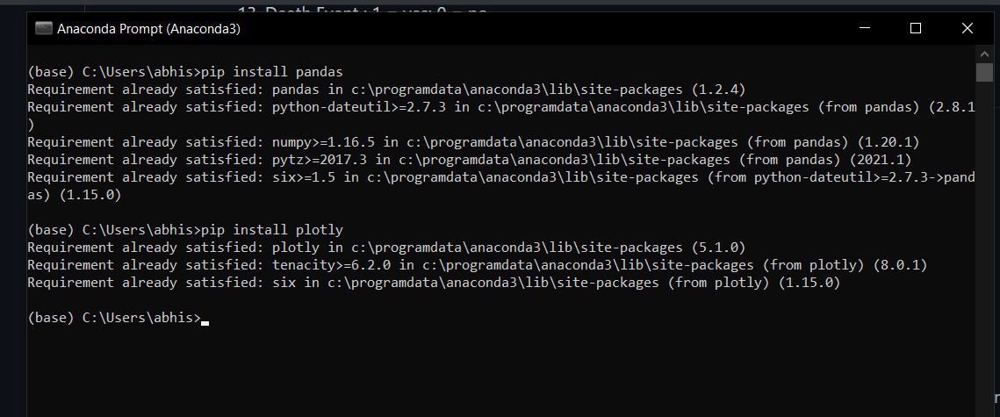
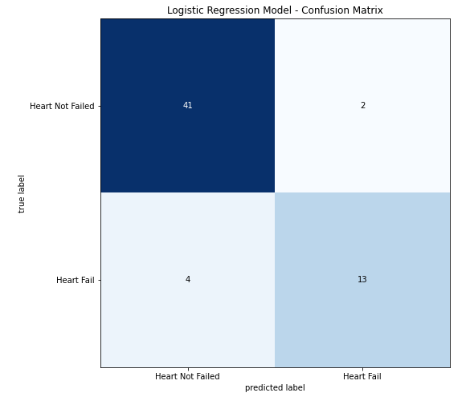

# Heart Failure Prediciton Model using machine learning
This is a heart failure prediction model using machine learning 


# Description 
Heart failure is one of the fatal diseases present globally and, 17 million people die annually due to it thus, it should be predicted at an earlier stage for better treatment. We ought to develop a heart failure prediction model using machine learning models such as logistic regression, support vector machine, decision tree and random forest. A clinical dataset has been used with 14 different parameters such as age, sex, ejection fraction, sodium creatinine, diabetes etc. Machine learning algorithms are deployed to predict heart failure in patients and accuracy of 90% is obtained and a confusion matrix is also generated for each classifier. The model will assist the doctors in diagnosis heart patients efficiently and heart failure can be predicted at an early stage such that it can be avoided by giving proper care.

# Dataset
the dataset utilized for building the heart failure prediction model is Heart Failure Prediction Data , which is publicly available. This clinical dataset has been used in the machine learning algorithms for the purpose of training and testing for predicting heart failure. This dataset consists of 300 patient data and it and consists of 13 different parameters. The most important parameter of the table are Ejection fraction and Serum Creatinine, and heart failure highly depends on these two parameters.

1. Age : Continous
2. Sex : 1 = male; 0 = female
3. Diabetes : 1 = yes; 0 = no
4. Anaemia : 1 = yes; 0 = no
5. High Blood Pressure : 1 = yes; 0 = no
6. Smoking : 1 = yes; 0 = no
7. Creatinine Phosophokinase ; Units/L
8. Platelets ; CBC number
9. Ejection Fraction ; Percentage
10. Serum Creatinine : mg/dL
11. Serum Sodium : mEg/L
12. Time: Hours
13. Death Event : 1 = yes; 0 = no

# Installation 

The whole project is on python, so one would need python 3.7 or later installed on the system. 


Click [here](https://www.python.org/downloads/), to download python.

The model works on four different machine learning classifier so required to install the libraries : Pandas, plotly,  matplotlib, seaborn, sklearn.model_selection.

```bash
pip install pandas
pip install plotly
pip install matplotlib 
pip install seaborn 
pip install sklearn
```



# Usage 

- Missing Values

Once all the required libraries are installed, we will checking the data set for missing values or anamolies.

```bash
dataset.isnull().sum()
```
- Training and Testing 

The model works on four machine learning classifier: Logistic Regression, Support Vector Machine, Decission Tree and Random Forest. We are required to spilt the dataset for training and testing purpose, and in this project we use the ration 80:20 for trainning and testing respectively. 
For accurate prediciton of heart failure, in this project we have used three main features: Ejection Fraction, Serum Creatinine and time which are highly responsible for heart failure.

```bash
Features = ['time','ejection_fraction','serum_creatinine']
x = dataset[Features]
y = dataset["DEATH_EVENT"]
x_train,x_test,y_train,y_test = train_test_split(x,y, test_size=0.2, random_state=2)
acc_list = []
```
- Evaluation 

The efficnecy of each classifier is measured through accuracy and the prediciton is showcased through confusion matirx for each model.

```bash
classifier = LogisticRegression()
classifier.fit(x_train, y_train)

# Predicting the Test set results
y_pred = classifier.predict(x_test)

from sklearn.metrics import confusion_matrix
cm_test = confusion_matrix(y_pred, y_test)

y_pred_train = classifier.predict(x_train)
cm_train = confusion_matrix(y_pred_train, y_train)

print()
print('Accuracy for training set for Logistic Regression = {}'.format((cm_train[0][0] + cm_train[1][1])/len(y_train)))
print('Accuracy for test set for Logistic Regression = {}'.format((cm_test[0][0] + cm_test[1][1])/len(y_test)))
```
Accuracy of the model is calculated and after this, confusion matrix is prepared.

```bash
cm = confusion_matrix(y_test, y_pred)
plt.figure()
plot_confusion_matrix(cm, figsize=(12,8), hide_ticks=True, cmap=plt.cm.Blues)
plt.title("Logistic Regression Model - Confusion Matrix")
plt.xticks(range(2), ["Heart Not Failed","Heart Fail"])
plt.yticks(range(2), ["Heart Not Failed","Heart Fail"])
plt.show()
```
- Results

The result of the model is a successfull confusion matrix, it consists of True and Predicted label.
Matrix consists of four outputs: 
1)	True Positive (TP): Patients who were correctly predicted for heart failure.
2)	True Negative (TN): Patients who are correctly predicted for no heart failure.
3)	False Positive (FP):  Patient who are incorrectly predicted for heart failure.
4)	False Negative (TN): Patients who are incorrectly predicted for no heart failure. 

The figure displays confusion matrix obtained from logistic regression model.




